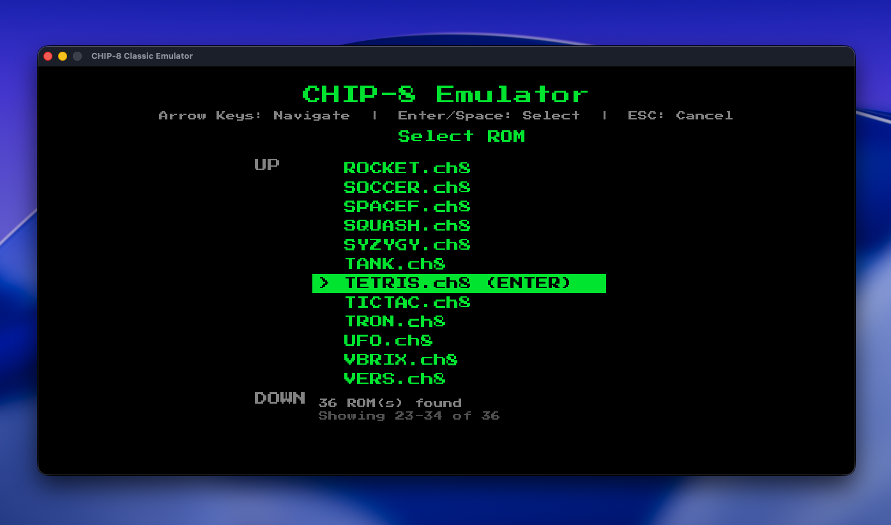
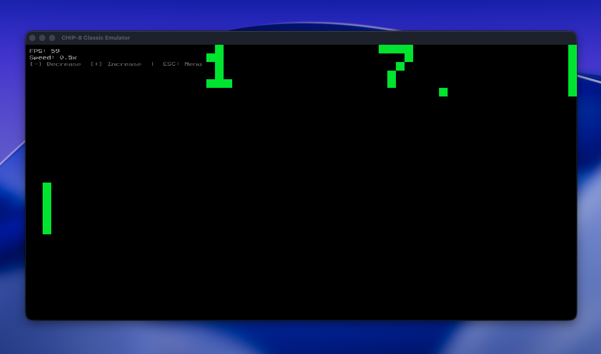
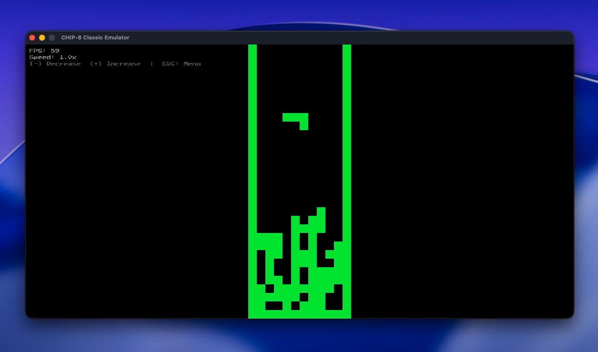
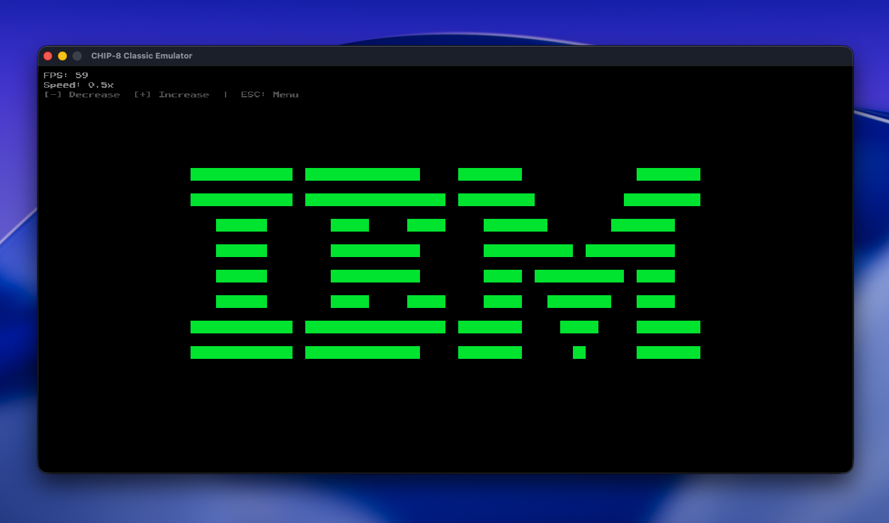

# CHIP-8 Emulator

A simple CHIP-8 emulator written in C++23 using Raylib for graphics and audio. This emulator implements all 35
CHIP-8 opcodes and provides a modern, user-friendly interface.


## Screenshots

<div>

|                           ROM Selection Menu                           |                           Pong Gameplay                           |
|:----------------------------------------------------------------------:|:-----------------------------------------------------------------:|
|  |  |
|              *Browse and select from available ROM files*              |                  *Classic Pong game with sound*                   |

|                            Tetris Gameplay                            |                             IBM Logo                             |
|:---------------------------------------------------------------------:|:----------------------------------------------------------------:|
|  |  |
|                   *Tetris running on the emulator*                    |                       *Display IBMs logo*                        |

</div>

## Features

- **Complete CHIP-8 Instruction Set** - All 35 opcodes implemented
- **ROM Selection Menu** - Easy browsing and selection of ROM files
- **Audio Support** - Programmatically generated beep sounds
- **Adjustable Speed** - Control emulation speed (0.5x to 10x)
- **ESC to Menu** - Return to ROM selector anytime during gameplay
- **Cross-Platform** - Works on macOS, Windows, and Linux

## Requirements

### Dependencies

- **CMake** 3.20 or higher
- **C++23 compatible compiler**:
    - GCC 13+ (Linux)
    - Clang 16+ (macOS/Linux)
    - MSVC 2022+ (Windows)
- **Raylib** 5.0 or higher

### Installing Raylib

#### macOS (using Homebrew)

```bash
brew install raylib
```

#### Linux (Ubuntu/Debian)

```bash
sudo apt-get install libraylib-dev
```

#### Linux (Fedora)

```bash
sudo dnf install raylib-devel
```

#### Windows

1. Download Raylib from [raylib.com](https://www.raylib.com/)
2. Extract and set `RAYLIB_PATH` environment variable, OR
3. Use vcpkg: `vcpkg install raylib`

#### Building raylib from source

If raylib is not available via package manager, CMake will attempt to download and build it automatically using
FetchContent.

## Building

### Quick Start

```bash
# Clone the repository
git clone https://github.com/yourusername/Chip8_Emulator.git
cd Chip8_Emulator

# Create build directory
mkdir build && cd build

# Configure and build
cmake ..
cmake --build .

# Run the emulator
./Chip8_Emulator
```

### Detailed Build Instructions

#### macOS (Tested)

```bash
mkdir build && cd build
cmake -DCMAKE_BUILD_TYPE=Release ..
cmake --build . -j$(sysctl -n hw.ncpu)
./Chip8_Emulator
```

#### Linux

```bash
mkdir build && cd build
cmake -DCMAKE_BUILD_TYPE=Release ..
cmake --build . -j$(nproc)
./Chip8_Emulator
```

#### Windows (Visual Studio)

```powershell
mkdir build
cd build
cmake .. -G "Visual Studio 17 2022"
cmake --build . --config Release
.\Release\Chip8_Emulator.exe
```

#### Windows (MinGW)

```bash
mkdir build && cd build
cmake .. -G "MinGW Makefiles"
cmake --build .
.\Chip8_Emulator.exe
```

## Usage

### Running the Emulator

1. **Interactive Mode** (Recommended):
   ```bash
   ./Chip8_Emulator
   ```
   This will show a ROM selection menu where you can browse and select ROM files.

2. **Direct ROM Loading**:
   ```bash
   ./Chip8_Emulator roms/PONG.ch8
   ```

### Controls

#### In ROM Selection Menu:

- **Arrow Keys (↑/↓)**: Navigate through ROM list
- **Enter/Space**: Select ROM
- **ESC**: Exit (on first menu) or return to menu (after playing)

#### During Emulation:

- **1-4, Q-R, A-F, Z-V**: CHIP-8 keypad input
- **ESC**: Return to ROM selection menu
- **- (Minus)**: Decrease emulation speed
- **+ (Plus)**: Increase emulation speed

### ROM Files

Place your `.ch8` ROM files in the `roms/` directory. The emulator will automatically scan and list all available ROMs.

## Architecture

The emulator follows a clean architecture with clear separation of concerns:

- **Core Layer**: Pure CHIP-8 emulation logic, no graphics dependencies
- **App Layer**: Raylib integration for rendering, input, and audio

## Testing

Test your emulator with these popular CHIP-8 ROMs:

- **PONG.ch8** - Classic Pong game
- **TETRIS.ch8** - Tetris
- **INVADERS.ch8** - Space Invaders
- **IBM.ch8** - IBM logo test ROM

## License

MIT License

## Acknowledgments

- [Cowgod's Chip-8 Technical Reference](https://github.com/trapexit/chip-8_documentation/blob/master/Misc/Cowgod's%20CHIP-8%20Technical%20Reference.pdf) -
  CHIP-8 specification
- [Raylib](https://www.raylib.com/) - Amazing graphics
  library. [Raylib Cheatsheet](https://www.raylib.com/cheatsheet/cheatsheet.html)
- CHIP-8 community for ROM files and testing. [ROM files](https://github.com/stianeklund/chip8/tree/master/roms)

## Troubleshooting

### Raylib not found

If CMake can't find Raylib:

1. Make sure Raylib is installed via package manager, OR
2. CMake will automatically download and build Raylib using FetchContent

### ROMs not showing

- Ensure ROM files are in the `roms/` directory
- ROM files must have `.ch8` extension
- Check that the `roms/` directory exists in the same directory as the executable

### Build errors

- Ensure you have a C++23 compatible compiler
- Update CMake to version 3.20 or higher
- On Windows, make sure you have Visual Studio Build Tools installed

